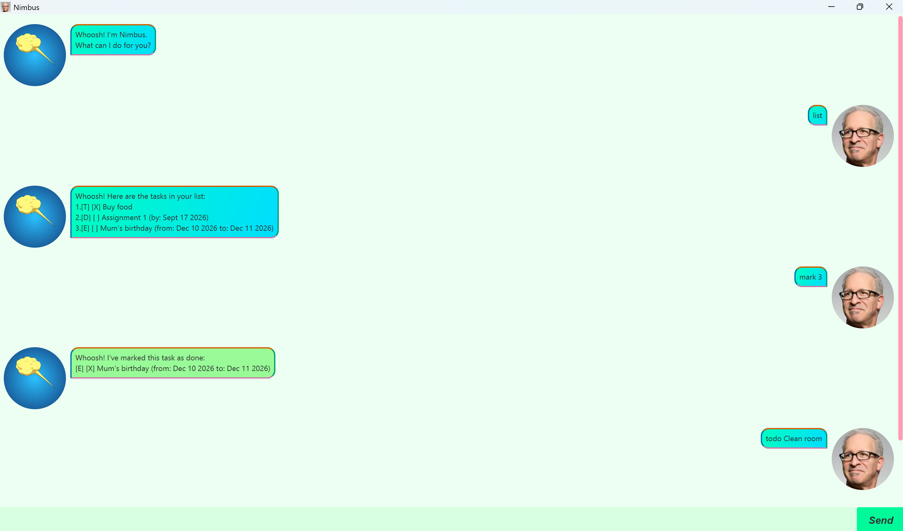

# Nimbus User Guide

Nimbus is a **desktop chatbot for managing your tasks**, with a graphical chat-style interface. Type a command into the input box, hit Enter (or click Send), and Nimbus replies in the chat window — so you get the speed of typed commands with the clarity of a GUI.

* [Quick Start](#quick-start)
* [Features](#features)
  * [Adding a todo: `todo`](#adding-a-todo-todo)
  * [Adding a deadline: `deadline`](#adding-a-deadline-deadline)
  * [Adding an event: `event`](#adding-an-event-event)
  * [Listing all tasks: `list`](#listing-all-tasks-list)
  * [Marking a task as done: `mark`](#marking-a-task-as-done-mark)
  * [Unmarking a task: `unmark`](#unmarking-a-task-unmark)
  * [Finding tasks: `find`](#finding-tasks-find)
  * [Deleting a task: `delete`](#deleting-a-task-delete)
  * [Exiting the program: `bye`](#exiting-the-program-bye)
* [FAQ](#faq)
* [Command Summary](#command-summary)

--------------------------------------------------------------------------------------------------------------------

## Quick Start

1. Ensure you have Java 25 or above installed on your computer.
2. Download the latest `nimbus.jar` from the releases page.
3. Copy the file to the folder you want to use as the home folder for Nimbus.
4. Double-click the jar file (or run `java -jar nimbus.jar` from a terminal) to launch the GUI.
5. Type a command into the input box at the bottom of the window and press Enter to send it. e.g. typing `list` and pressing Enter will show all your tasks in the chat window.
6. Refer to the [Features](#features) below for details of each command.

On launch, Nimbus greets you in the chat window with:

> Whoosh! I'm Nimbus. 
> What can I do for you?

--------------------------------------------------------------------------------------------------------------------

## Features

> **Notes on the command format**
> * Words in `UPPER_CASE` are parameters to be supplied by you. 
>   e.g. in `todo DESCRIPTION`, `DESCRIPTION` is a parameter which can be used as `todo return book`.
> * Task numbers used by `mark`, `unmark`, and `delete` refer to the index shown in the most recent `list` or `find` reply, starting from 1.
> * Dates are entered in `yyyy-mm-dd` format, and are shown back to you as `MMM dd yyyy` (e.g. `2026-09-30` is entered, `Sep 30 2026` is displayed).
> * Each example below shows the command you type, followed by Nimbus's chat reply.

### Adding a todo: `todo`

Adds a simple task with no date or time attached to Nimbus's task list.

You type: `todo return book`

Nimbus replies:
> Whoosh! Got it. I've added this task: 
> [T][ ] return book 
> Whoosh! Now you have 1 tasks in the list.

### Adding a deadline: `deadline`

Adds a task that needs to be done by a specific date.

You type: `deadline submit report /by 2026-09-30`

Nimbus replies:
> Whoosh! Got it. I've added this task: 
> [D][ ] submit report (by: Sep 30 2026) 
> Whoosh! Now you have 2 tasks in the list.

### Adding an event: `event`

Adds a task that starts and ends on specific dates.

You type: `event project meeting /from 2026-10-01 /to 2026-10-02`

Nimbus replies:
> Whoosh! Got it. I've added this task: 
> [E][ ] project meeting (from: Oct 01 2026 to: Oct 02 2026) 
> Whoosh! Now you have 3 tasks in the list.

### Listing all tasks: `list`

Shows a list of all tasks currently in Nimbus, in the order they were added.

You type: `list`

Nimbus replies:
> Whoosh! Here are the tasks in your list: 
> 1. [T][ ] return book 
> 2. [D][ ] submit report (by: Sep 30 2026) 
> 3. [E][ ] project meeting (from: Oct 01 2026 to: Oct 02 2026)

### Marking a task as done: `mark`

Marks the specified task as done.

You type: `mark 1`

Nimbus replies:
> Whoosh! I've marked this task as done: 
> [T][X] return book

### Unmarking a task: `unmark`

Marks the specified task as not done.

You type: `unmark 1`

Nimbus replies:
> Whoosh! I've marked this task as not done yet: 
> [T][ ] return book

### Finding tasks: `find`

Finds tasks whose description contains the given keyword (case-insensitive).

You type: `find report`

Nimbus replies:
> Whoosh! Here are the tasks in your list: 
> 1. [D][ ] submit report (by: Sep 30 2026)

### Deleting a task: `delete`

Deletes the specified task from Nimbus.

You type: `delete 3`

Nimbus replies:
> Whoosh! I've removed this task: 
> [E][ ] project meeting (from: Oct 01 2026 to: Oct 02 2026) 
> Whoosh! Now you have 2 tasks in the list.

### Exiting the program: `bye`

Closes the Nimbus window.

You type: `bye`

Nimbus replies:
> Bye. Hope to see you again soon! Whoosh!

--------------------------------------------------------------------------------------------------------------------

## FAQ

**Q**: How do I transfer my data to another computer? 
**A**: Install Nimbus on the other computer and copy over the data file created after adding tasks on your first computer.

--------------------------------------------------------------------------------------------------------------------

## Command Summary

| Action | Format | Example |
|--------|--------|---------|
| Todo | `todo DESCRIPTION` | `todo return book` |
| Deadline | `deadline DESCRIPTION /by yyyy-mm-dd` | `deadline submit report /by 2026-09-30` |
| Event | `event DESCRIPTION /from yyyy-mm-dd /to yyyy-mm-dd` | `event project meeting /from 2026-10-01 /to 2026-10-02` |
| List | `list` | `list` |
| Mark | `mark INDEX` | `mark 1` |
| Unmark | `unmark INDEX` | `unmark 1` |
| Find | `find KEYWORD` | `find report` |
| Delete | `delete INDEX` | `delete 3` |
| Exit | `bye` | `bye` |
